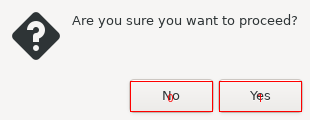
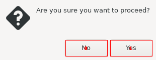

Experimental Python library for discovering GUI elements.

Links:
 * home: https://github.com/ponty/discogui
 * PYPI: https://pypi.python.org/pypi/discogui


Features:
 * python module
 * works on Linux
 * does not depend on Accessibility technologies
 * toolkit independent
 * only basic tests on very simple GUI
 * GUI should be displayed on Xvfb or Xephyr
 
Possible applications:
 * automatic GUI testing
 * automatic GUI control

Installation::
    
```console
$ sudo apt install xvfb
$ python3 -m pip install discogui
```

Usage
=====


button discovery on zenity using tab order
------------------------------------------

```py
# discogui/examples/taborder.py

"""
1. start zenity Yes/No dialog on Xvfb
2. discover buttons using tab order
3. print rectangles
4. draw red rectangles on screenshot
"""
from easyprocess import EasyProcess
from pyvirtualdisplay.smartdisplay import SmartDisplay

from discogui.buttons import discover_buttons
from discogui.draw import draw_indexed_rect_list
from discogui.imgutil import autocrop

with SmartDisplay(visible=False) as disp:
    with EasyProcess(["zenity", "--question"]):
        img = disp.waitgrab(timeout=60, autocrop=False)
        rectangles = discover_buttons()
        print(rectangles)

img = draw_indexed_rect_list(img, rectangles)
img = autocrop(img)

# save results
img.save("taborder.png")

```

<!-- embedme doc/gen/python3_-m_discogui.examples.taborder.txt -->
Run it:
```console
$ python3 -m discogui.examples.taborder
[ScreenRect((426,415,508,445)), ScreenRect((515,415,597,445))]
```

Image:




button discovery on zenity using mouse hovering
-----------------------------------------------

```py
# discogui/examples/hover.py

"""
1. start zenity Yes/No dialog on Xvfb
2. discover buttons using mouse hovering
3. print rectangles
4. draw red rectangles on screenshot
"""
from easyprocess import EasyProcess
from pyvirtualdisplay.smartdisplay import SmartDisplay

from discogui.draw import draw_indexed_rect_list
from discogui.hover import active_rectangles
from discogui.imgutil import autocrop

with SmartDisplay(size=(640, 480), visible=False) as disp:
    with EasyProcess(["zenity", "--question"]):
        img = disp.waitgrab(timeout=60, autocrop=False)
        rectangles = active_rectangles()
        print(rectangles)
img = draw_indexed_rect_list(img, rectangles)
img = autocrop(img)

# save results
img.save("hover.png")

```

<!-- embedme doc/gen/python3_-m_discogui.examples.hover.txt -->
Run it:
```console
$ python3 -m discogui.examples.hover
[ScreenRect((234,270,317,302)), ScreenRect((323,270,406,302))]
```


Image:



button test
-----------

```py
# discogui/examples/clickbutton.py

"""
1. start zenity Yes/No dialog on Xvfb
2. discover buttons using `discogui.buttons` module
3. click first button, print return code
4. click second button, print return code
"""

from easyprocess import EasyProcess
from pyvirtualdisplay.smartdisplay import SmartDisplay

from discogui.buttons import discover_buttons
from discogui.mouse import PyMouse


def click_button_get_return_code(disp, which_button):
    with EasyProcess(["zenity", "--question"]) as p:
        disp.waitgrab(timeout=60)
        rectangles = discover_buttons()
        PyMouse().click(*rectangles[which_button].center)
        return p.wait().return_code


with SmartDisplay() as disp:
    print(click_button_get_return_code(disp, 0))
with SmartDisplay() as disp:
    print(click_button_get_return_code(disp, 1))

```

<!-- embedme doc/gen/python3_-m_discogui.examples.clickbutton.txt -->
Run it:
```console
$ python3 -m discogui.examples.clickbutton
1
0
```


