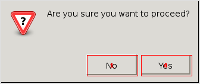

``discogui`` discovers GUI elements

Links:
 * home: https://github.com/ponty/discogui
 * documentation: http://discogui.readthedocs.org
 * PYPI: https://pypi.python.org/pypi/discogui

|Travis| |Coveralls| |Latest Version| |Supported Python versions| |License| |Code Health| |Documentation|

Features:
 * python module
 * works on Linux
 * does not depend on Accessibility technologies
 * toolkit independent
 * only  basic tests on very simple GUI
 * GUI should be displayed on Xvfb or Xephyr
 
Known problems:
 - Python 3 is not supported
 - slow

Possible applications:
 * automatic GUI testing
 * automatic GUI control

Basic usage
===========
::

    from discogui.buttons import discover_buttons
    from easyprocess import EasyProcess
    from pyvirtualdisplay import Display
    with Display():
        with EasyProcess('zenity --question') as p:   
            p.sleep(1)         
            buttons = discover_buttons()
    print buttons

Installation
============

General
-------

 * install Xvfb_ and Xephyr_
 * install Xlib
 * install scrot
 * install PIL_
 * install xdotool
 * install pip_
 * install latest PyMouse and the program::

    # as root
    pip install https://github.com/pepijndevos/PyMouse/zipball/master
    pip install discogui

Ubuntu 14.04
------------
::

    sudo apt-get install python-pip xvfb python-xlib scrot python-pil xdotool
    sudo pip install https://github.com/pepijndevos/PyMouse/zipball/master
    sudo pip install discogui

Uninstall
---------
::

    # as root
    pip uninstall discogui

Usage
=====

..  #-- from docs.screenshot import screenshot--#  
..  #-#

basic
-----

Code::
      
  #-- include('examples/basic.py')--#
  '''
  1. start zenity Yes/No dialog on Xvfb
  2. discover buttons using :mod:`discogui.buttons` module
  3. print rectangles
  '''
  from discogui.buttons import discover_buttons
  from easyprocess import EasyProcess
  from pyvirtualdisplay import Display

  def main():
      with Display(visible=0):
          with EasyProcess('zenity --question') as p:
              p.sleep(5)
              buttons = discover_buttons()
      print( buttons )

  if __name__ == '__main__':
      main()
  #-#
      
    
Output::

  #-- sh('python -m discogui.examples.basic 2>/dev/null')--#
  [ScreenRect((582,407,667,442)), ScreenRect((491,407,576,442))]
  #-#

button discovery on zenity
--------------------------

Code::
      
  #-- include('examples/buttondiscovery.py')--#
  '''
  1. start zenity Yes/No dialog on Xvfb
  2. discover buttons using :mod:`discogui.buttons` module
  3. print rectangles
  4. draw red rectangles on screenshot
  '''
  from easyprocess import EasyProcess
  from pyscreenshot import grab
  from discogui.buttons import discover_buttons
  from discogui.draw import draw_indexed_rect_list
  from discogui.imgutil import autocrop
  from pyvirtualdisplay import Display

  def main():
      with Display(visible=0):
          with EasyProcess('zenity --question') as p:
              p.sleep(1)

              img = grab()
              rectangles = discover_buttons()
              print( rectangles )

      img = draw_indexed_rect_list(img, rectangles)
      img = autocrop(img)

      # display results
      img.show()

  if __name__ == '__main__':
      main()
  #-#
      
Image:

..  #-- screenshot('python -m discogui.examples.buttondiscovery','screenshot_buttondiscovery.png') --#

..  #-#

button discovery on gnumeric
----------------------------

Code::
      
  #-- include('examples/hovergnumeric.py')--#
  '''
  1. start gnumeric on Xvfb with low ersolution
  2. discover buttons using :mod:`discogui.hover` module
  3. print rectangles
  4. draw red rectangles on screenshot
  '''
  from discogui.draw import draw_indexed_rect_list
  from discogui.hover import active_rectangles
  from discogui.imgutil import autocrop
  from easyprocess import EasyProcess
  # from pyscreenshot import grab
  # from pyvirtualdisplay import Display
  from pyvirtualdisplay.smartdisplay import SmartDisplay
  # import time

  def main():
      with SmartDisplay(size=(640, 480), visible=0) as disp:
          with EasyProcess('gnumeric'):
  #            time.sleep(2)
              img = disp.waitgrab(timeout=60)
              rectangles = active_rectangles()
              print( rectangles )

      img = draw_indexed_rect_list(img, rectangles)
      img = autocrop(img)

      # display results
      img.show()

  if __name__ == '__main__':
      main()
  #-#
      
Image:

..  #-- screenshot('python -m discogui.examples.hovergnumeric','screenshot_hovergnumeric.png') --#
.. image:: _img/screenshot_hovergnumeric.png
..  #-#

button test
-----------

Code::
      
  #-- include('examples/clickbutton.py')--#
  '''
  1. start zenity Yes/No dialog on Xvfb
  2. discover buttons using :mod:`discogui.buttons` module
  3. click first button, print return code
  4. click second button, print return code
  '''
  from discogui.buttons import discover_buttons
  from discogui.mouse import PyMouse
  from easyprocess import EasyProcess
  from pyvirtualdisplay import Display
  import time

  def click_button_get_return_code(which_button):
      with EasyProcess('zenity --question') as p:
          time.sleep(1)
          rectangles = discover_buttons()
          PyMouse().click(*rectangles[which_button].center)
          return p.wait().return_code

  def main():
      with Display():
          print( click_button_get_return_code(0) )
          print( click_button_get_return_code(1) )

  if __name__ == '__main__':
      main()
  #-#

Output::

  #-- sh('python -m discogui.examples.clickbutton 2>/dev/null')--#
  0
  1
  #-#

.. _setuptools: http://peak.telecommunity.com/DevCenter/EasyInstall
.. _pip: http://pip.openplans.org/
.. _Xvfb: http://en.wikipedia.org/wiki/Xvfb
.. _Xephyr: http://en.wikipedia.org/wiki/Xephyr
.. _PIL: http://www.pythonware.com/library/pil/

.. |Travis| image:: http://img.shields.io/travis/ponty/discogui.svg
   :target: https://travis-ci.org/ponty/discogui/
.. |Coveralls| image:: http://img.shields.io/coveralls/ponty/discogui/master.svg
   :target: https://coveralls.io/r/ponty/discogui/
.. |Latest Version| image:: https://img.shields.io/pypi/v/discogui.svg
   :target: https://pypi.python.org/pypi/discogui/
.. |Supported Python versions| image:: https://img.shields.io/pypi/pyversions/discogui.svg
   :target: https://pypi.python.org/pypi/discogui/
.. |License| image:: https://img.shields.io/pypi/l/discogui.svg
   :target: https://pypi.python.org/pypi/discogui/
.. |Code Health| image:: https://landscape.io/github/ponty/discogui/master/landscape.svg?style=flat
   :target: https://landscape.io/github/ponty/discogui/master
.. |Documentation| image:: https://readthedocs.org/projects/discogui/badge/?version=latest
   :target: https://readthedocs.org/projects/discogui/?badge=latest

